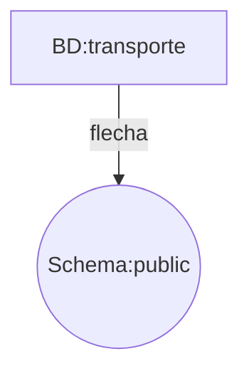

# Jerarquía de Bases de Datos

Toda jerarquía de base de datos se basa en los siguientes elementos:

- Servidor de base de datos: Computador que tiene un motor de base de datos instalado y en ejecución.

- Motor de base de datos: Software que provee un conjunto de servicios encargados de administrar una base de datos.

- Base de datos: Grupo de datos que pertenecen a un mismo contexto.

- Esquemas de base de datos en PostgreSQL: Grupo de objetos de base de datos que guarda relación entre sí (tablas, funciones, relaciones, secuencias).

- Tablas de base de datos: Estructura que organiza los datos en filas y columnas formando una matriz.

PostgreSQL es un motor de base de datos.

La estructura de la base de datos diseñada para el reto corresponde a los siguientes elementos:

La base de datos se llama transporte, usaremos su esquema predeterminado public.

El esquema public contiene las siguientes tablas:

Estación

Pasajero

Tren

Y las tablas de relaciones entre cada uno de los elementos anteriores son:

Trayecto

Viaje

El esquema relacional entre las tablas corresponde al siguiente diagrama:

[Diagrama en OneNote](https://udlaedu-my.sharepoint.com/:o:/g/personal/jho_castano_udla_edu_co/EhSghH-c5QNDp3tqirH82kYBXWhthm6-zOFinONDGSHuxA?e=xLf9x9)

Estación
Contiene la información de las estaciones de nuestro sistema, incluye datos de nombre con tipo de dato texto y dirección con tipo de dato texto, junto con un número de identificación único por estación.

Tren
Almacena la información de los trenes de nuestro sistema, cada tren tiene un modelo con tipo de dato texto y una capacidad con tipo de dato numérico que representa la cantidad de personas que puede llevar ese tren, también tiene un ID único por tren.

Trayecto
Relaciona los trenes con las estaciones, simula ser las rutas que cada uno de los trenes pueden desarrollar entre las estaciones

Pasajero
Es la tabla que contiene la información de las personas que viajan en nuestro sistema de transporte masivo, sus columnas son nombre tipo de dato texto con el nombre completo de la persona, direccion_residencia con tipo de dato texto que indica dónde vive la persona, fecha_nacimiento tipo de dato texto y un ID único tipo de dato numérico para identificar a cada persona.

Viaje
Relaciona Trayecto con Pasajero ilustrando la dinámica entre los viajes que realizan las personas, los cuales parten de una estación y se hacen usando un tren.

